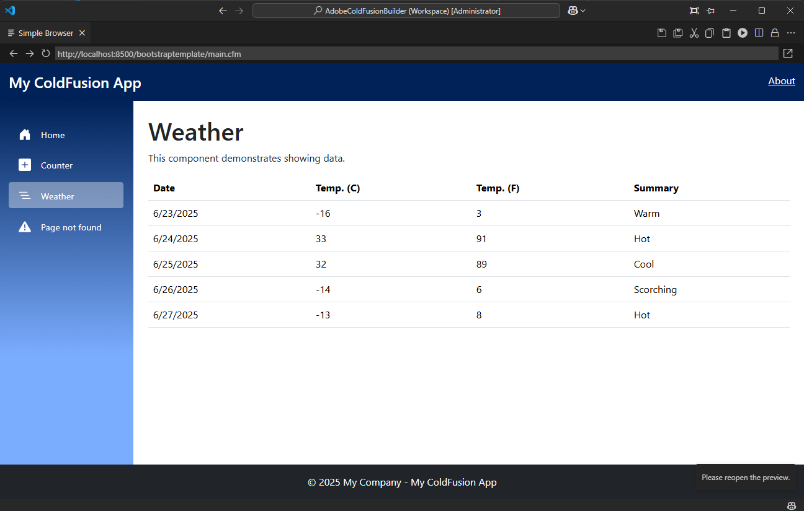

# Adobe ColdFusion Project Template with Bootstrap and jQuery inspired by Blazor
<!-- Badges -->

This is a Visual Studio Code template extension for creating a ColdFusion project with Bootstrap and jQuery integration, inspired by Blazor Web App.

## Features

- Generates a new Adobe ColdFusion project structure
- Includes Bootstrap 5.3.6 and jQuery 3.7.1 by default
- Includes sample pages inspired by a Blazor Web App.

## Usage

1. Open the Command Palette (`Ctrl+Shift+P`)
2. Type `Adobe ColdFusion: Create new project template with Bootstrap and jQuery inspired by Blazor Web App`
3. Select a folder and the template will be applied

## Author

FrameCode Inc.